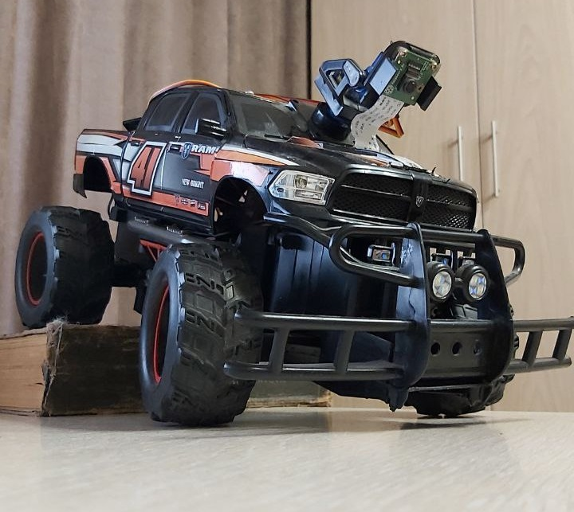

# CV pi car

    

    

Here is project of my simple robocar presented. The main idea is to get images from Raspberry Pi camera, recognize
simulated road lane and make the wheeled base follow the lane.

## Structure of the robocar

Basically the project consists of two main parts - hardware and software. To learn more about each of them, check
following readmes:

* Hardware part - [README_hardware](README_hardware.md).
* Software part - [README_software](README_software.md).
