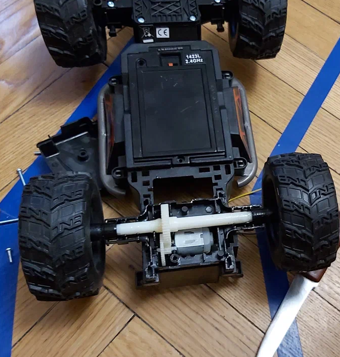
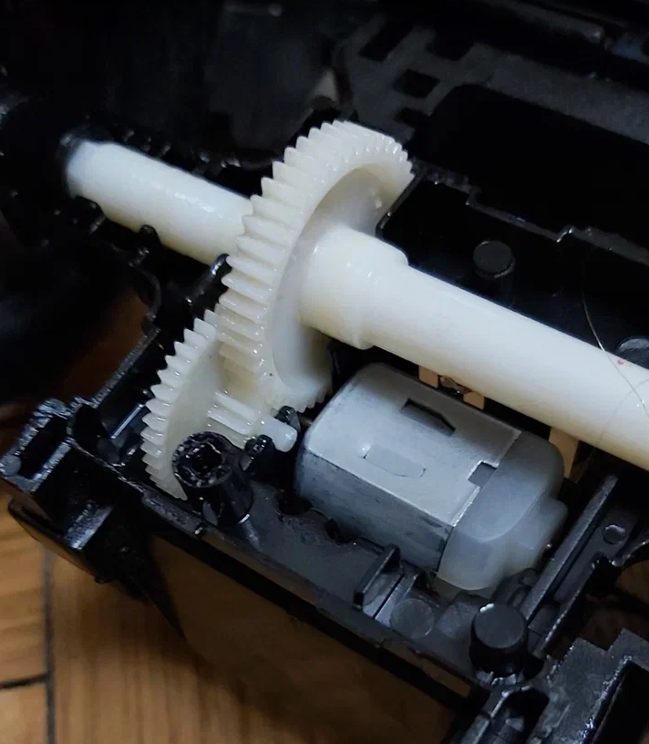
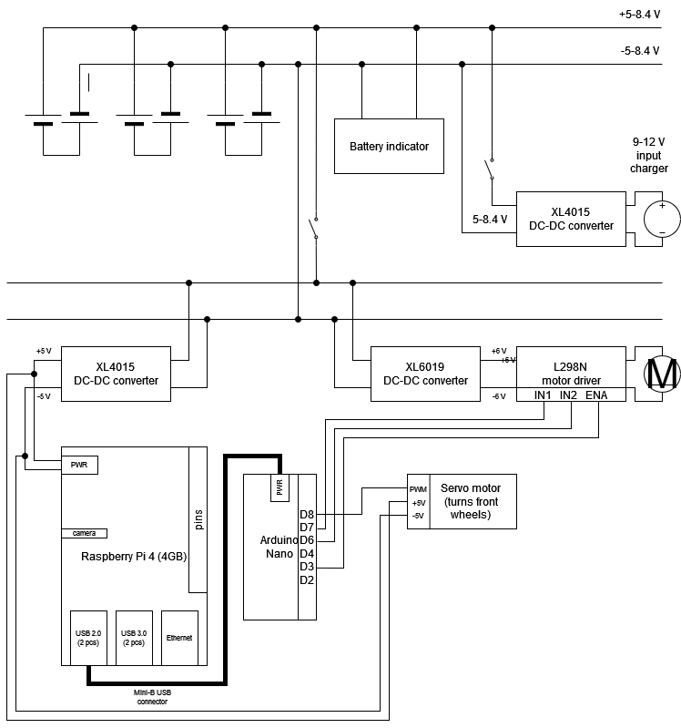
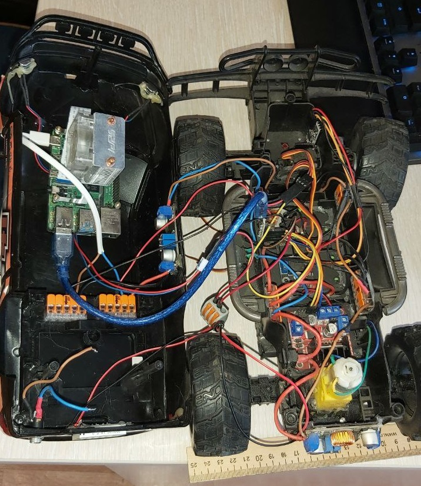

# Hardware

To assemble the wheelbase, I used an old radio-controlled car and slightly modified it.

## Preparing robocar base

So that the front wheels could be controlled using Arduino, I attached a servo to the rotary mechanism. To me
lucky - there was already a rotary gear. I also replaced the motor that drives the rear wheels:

    
    

Now the robocar base ready to install other Arduino-similar components and Raspberry Pi!

    

## Assembling robocar

All I needed to do next - is to connect wheels, arduino and Raspberry Pi together. To achieve if I developed and
assembled following scheme:

    

Every component you can order at Aliexpress. Assembling and soldering result looks a bit messy, but everything works
well:

    

