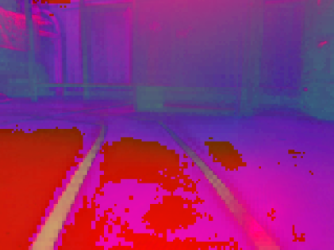
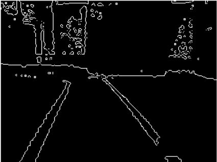
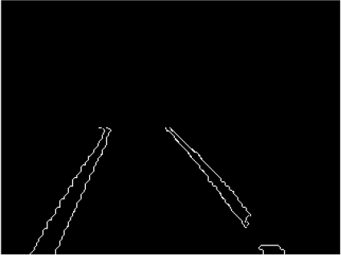
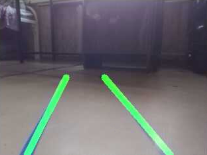
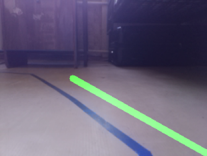
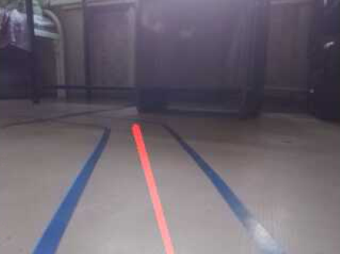

## Software

The task of the algorithm is a vector for each frame, an angle of which shows (from 0 to 180 degrees) the force with
which the wheels must be turned and the direction. This angle is passed from the Raspberry Pi to the Arduino, which
makes the servo motor to turn the wheels in the desired direction.

Original image may look like:

    

We convert it to HSV format. So we can choose the range of recognizable colors:

    

Create a mask to highlight blue areas from a given range of colors:

    

Using the Kenny edge detector, we find the corners in the resulting image:

    

Get rid of unnecessary borders, leaving only road markings:

    

Using the Hough transform, we obtain the coordinates of the lines on the image:

    

Since at point 5 we get the coordinates not of two lines, but of bunch, it is necessary to convert them into
coordinates of two lines (or one if the second one is not visible):

    
    

Now when we have the start and end coordinates for both lanes, we can calculate the angle of the direction line. The
target slope line looks like this:

    

In this way, the Raspberry Pi considers the angle of rotation, and the arduino turns the front wheels and rotates the
DC motor on back wheels.

## Environment

1. Python 3.7.3.
2. OpenCV 3.4.3.

## Sources

1. [DeepPiCar — Part 1: How to Build a Deep Learning, Self Driving Robotic Car on a Shoestring Budget](https://towardsdatascience.com/deeppicar-part-1-102e03c83f2c).
